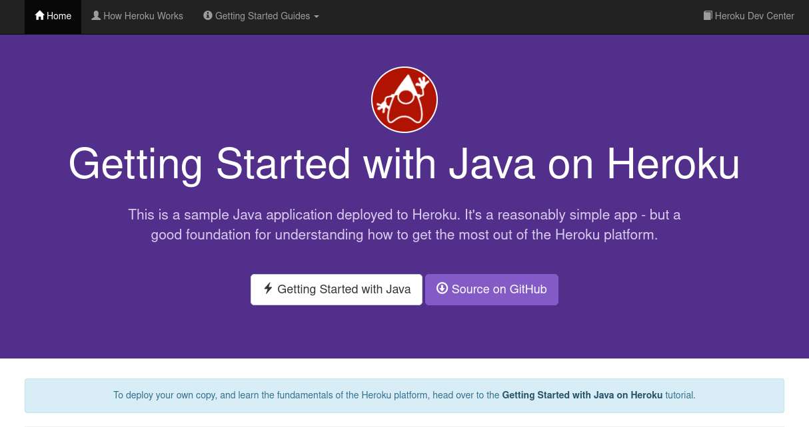

# DAT250 EXPASS1

## Introduction
The goal of the assigment is to create a working Software Development Enviroment needed for the rest of the subject. The main software we are going to use is [Heroku](https://www.heroku.com), which is a Cloud Application Platform that will help us with Cloud Computation and deploying apps. In my case, I am using a Linux distro, based on ArchLinux, so every explanation will refer to my own case.

## Installation
### Updating
First of all, I updated my computer, so everything is up to the lastest version.
```
paru -Syu
```

### Maven installation
As JDK, Eclipse and a git client were already installed in my PC, the next step is to install Maven, so I downloaded it from the [official site](https://maven.apache.org/), unzipped the compressed file and added the bin folder to the enviroment variable PATH.
```
wget https://dlcdn.apache.org/maven/maven-3/3.8.6/binaries/apache-maven-3.8.6-bin.zip
unzip apache-maven-3.8.6-bin.zip
cd apache-maven-3.8.6/bin
export PATH=$PATH:$(pwd)
```

To check if maven is already working, by writing this in the terminal `mvn -v` something like this should appear:
```
Apache Maven 3.8.6 (84538c9988a25aec085021c365c560670ad80f63)
Maven home: /opt/maven
Java version: 18.0.2, vendor: N/A, runtime: /usr/lib/jvm/java-18-openjdk
Default locale: es_ES, platform encoding: UTF-8
OS name: "linux", version: "5.15.60-1-manjaro", arch: "amd64", family: "unix"
```

It is worth mentioning that if we close the terminal, the PATH variable resets. As I don't want to change this variable forever I will change the PATH everytime I want to work on this.

### Java installation
For the Heroku installation we need some requirements. As I have already installed Maven, and it is easy to create a Heroku account, I skip this parts. The next thing to do is to install Java 8, that I had already have installed but, it is not working, as the output of `java --version` is the following: 
``` 
openjdk 18.0.2 2022-07-19
OpenJDK Runtime Environment (build 18.0.2+9)
OpenJDK 64-Bit Server VM (build 18.0.2+9, mixed mode)
```

As I said, I already have Java 8 installed. By doing `archlinux-java status`, we can check the Java versions that I have:
```
Available Java environments:
  java-11-openjdk
  java-18-openjdk (default)
  java-8-openjdk
```

We must change the version with `sudo archlinux-java set java-8-openjdk`, and if we do `java -version` we can see that we have Java 8 version working.
```
openjdk version "1.8.0_345"
OpenJDK Runtime Environment (build 1.8.0_345-b01)
OpenJDK 64-Bit Server VM (build 25.345-b01, mixed mode)
```

This change of version isn't maybe needed, as Heroku specifies the Java version it uses, but in case there is any problem, it is worth changing it.

### Postgresql Installation
The last requirement for installing Heroku, is to install postgresql with `paru -S postgresql`. First of all, following the [ArchLinux page about postgresql](https://wiki.archlinux.org/title/PostgreSQL#Installation), and in order to avoid any problems that could happend, we should start the database by doing:
```
sudo systemctl start postgresql
```

The archlinux wiki also recomends to create a postgresql user with our Linux username, in order to be more confortable and to avoid having to log in as the default postgresql user, whose name is postgres. To get this we just have to introduce the next following commands by changing javier by the username we want to give a role.
```
sudo -iu postgres
[postgres@javier]$ createuser --interactive
[postgres@javier]$ su javier
createdb myDatabase
```

After this we can do `psql` with our default username in order to check if everything is working. If we don't do this last step, an error will appear. If everything has been done well, something like this should appear:
```
psql (14.3)
Digite «help» para obtener ayuda.

javier=>
```

### Heroku Installation
The installation of Heroku is very simple as their tutorial is very clear. First of all we install de Heroku client.
```
paru -S heroku-cli
```

Next we just login into the Heroku client, and after this, in order to test everything, we can use the test app from the tutorial. We create it and then we push it to the repository.
```
heroku login
git clone https://github.com/heroku/java-getting-started
cd java-getting-started
heroku create
git push heroku main
```

Now we are prepared to deploy our app with the command `heroku open`. In my case, this command fails for some reason that I haven't already discover when it tries to open the browser . The error given is the following:
```
 ▸    Error opening web browser.
 ▸    Error: Exited with code 4
 ▸    
 ▸    Manually visit https://warm-beyond-16410.herokuapp.com/ in your browser.
 ```

I didn't manage to solve this, but it is not important as you can manually open the link given and deploy the app as usual. If something like the picture appears, it means that the app is working succesfully.


