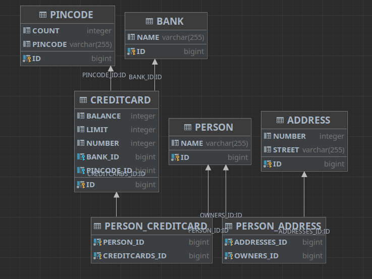

# DAT250 EXPASS2

## Source code
[Student source Code](https://github.com/SrMateos/dat250-jpa-example)

## Introduction 
The main objective of this is assigment is to learn how to use the Java Persistence Arquitecture (JPA) by using it in a project. 

## Experiment 2
### Importing de project and JPA JAR files and installation
The project is based on a [repository](https://github.com/timKraeuter/dat250-jpa-example) which is given to us. As the project already came with the needed JAR files, and everything was installed, the only thing left was to import the project as a maven project.

### Problems
One problem that I faced, was that I got some sql errors. This problem was solved by following the comment in the test code about removing the db folder. 

To avoid problems with JPA and JUnit, I had to change every Collection Type Attribute of the Java Classes to a Set, because if I left them as a Collection, the tests wouldn't work (despite the fact that the main.java was creating the database with the right scheme). This is because one of the tests assertions compares with a Set, and JPA changes Collections Type Attributes to Lists. That assertion is in the 49th line of the `MainTest.java` file, and the line is the following:

```
        assertThat(address.getOwners(), is(Set.of(person)));
```

When reading the Collection from the database, a list was returned, so the tests compared a List with Set, throwing an error. After changing every Collection to Sets, everything was working fine.

### Database inspection
In order to inspect the database in Intellij I followed the steps of the given tutorial. First just open de database view by clicking on the database button on the right.


Next we click on  `+ > Data Source > Apache Derby`.


We give a name, the path of the database, which is found in the `persistence.xml` file, and we also enter the user and password that are in the same place.


After this we just right click on the experiment2 dropdown generated in the database view, and click on `Diagrams > Show visualization`. With that we can see the scheme generated.


