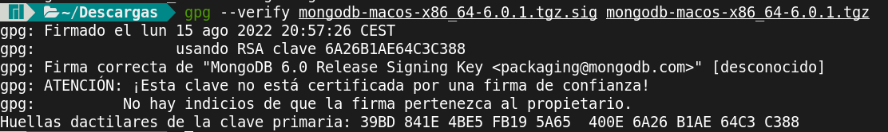
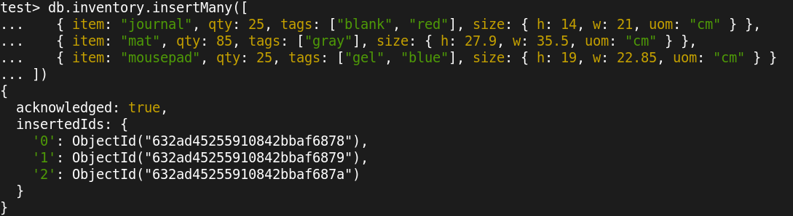
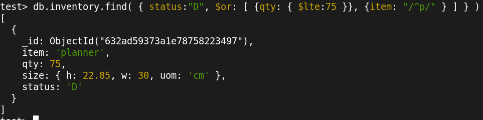
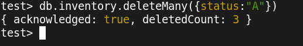
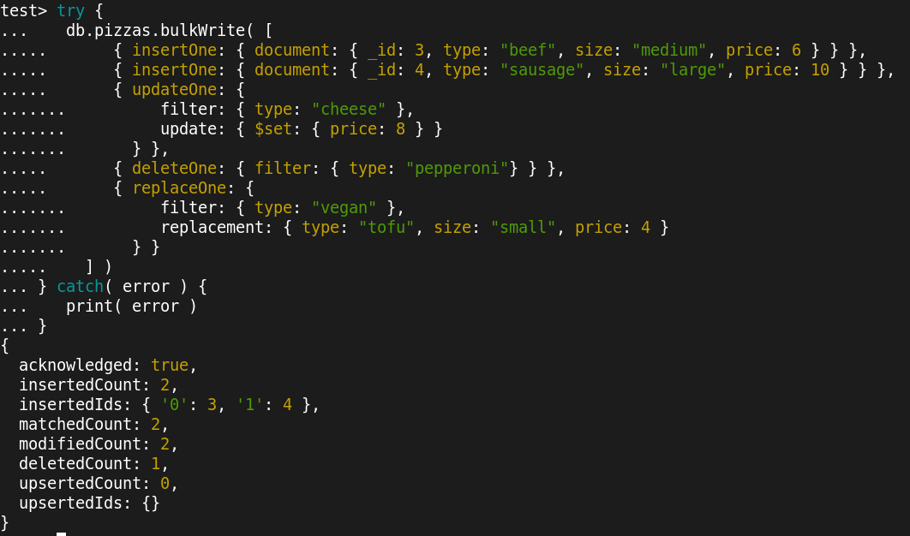
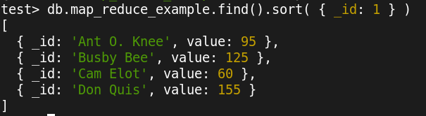
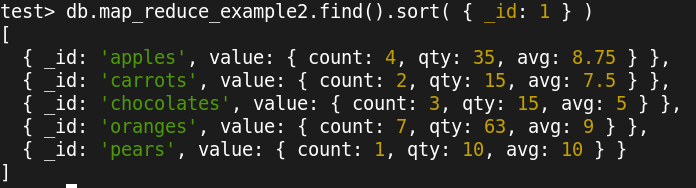

# DAT250 EXPASS3
## Introduction
The objetive of this assignment is to understand how to use mongodb to perform basic CRUD operations as well as aggregation.

## Validation of the installation package
I am using ArchLinux, so there is no official support for mongodb, but [AUR](https://aur.archlinux.org/) repository provides de package from Ubuntu. At the moment of installing it, the repository installer of ArchLinux checks by default the sha256 hashes, so if mongodb was installed correctly, it means that the hashes should be fine. To check it, by following the [verification tutorial](https://www.mongodb.com/docs/manual/tutorial/verify-mongodb-packages/), we get to see that everything is working.

Note: In the first picture we can see a warning but the sign is correct. As it is not a big problem and it is probably caused by the non-official repositories, we can just suppose that everything is fine (or that is what I was told to do by the lab assistant).

## Experiment 1
### Create operation
With the method `insertMany` we can introduce some documents into collections, in this case the collection is `inventory`. Every single document should have an id.

### Read operation
With the `find` function we can query data from collections, in this case the collection is `inventory`. We can also apply filters to take the attributes that has an specific value, or that satisfies certain conditions. In this case we are looking for those documents whose status are "D", and their qty is lower than 75 or the name of the attribute item starts with "p".

### Update operation
With the `update` operation we can change the value of certain attributes. In this case we want to update those objects whose status is "D", and we want to set their qty to 28. We also update the currentDate to the date of the last modification. 

### Delete operation
With the `delete` operation we can remove data that matches certain values. In our case we are deleting every document whose status is "A".

### Bulk operation
In adition to the crud operation we can even combine the CRUD operations into one single command with the bulk operations.

## Experiment 2
### Example 1
The results are the same as the ones from the tutorial.

### Example 2
The results are the same as the ones from the tutorial.

### Additional MapReduce 
My map reduce consist on retrieving the total money which is won per day. This might be helpful to see a daily record of a store, or maybe you could also filter by price and then do a study to see which days people buy more things, so you could place discounts strategically.
The MapReduce starts by calling mapFunction1, which emits a key value formed by the ord_date and the price. After this, the mapFunction2 is called and this just returns an array with the sum of prices. With this we have a collection which stores the day and the sum of everything that has been bought that day. This collection name will be "map_reduce_price_per_day", which we will show with a find, so we can check that the values are correct, and they actually are.

